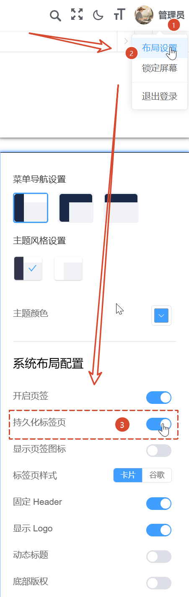
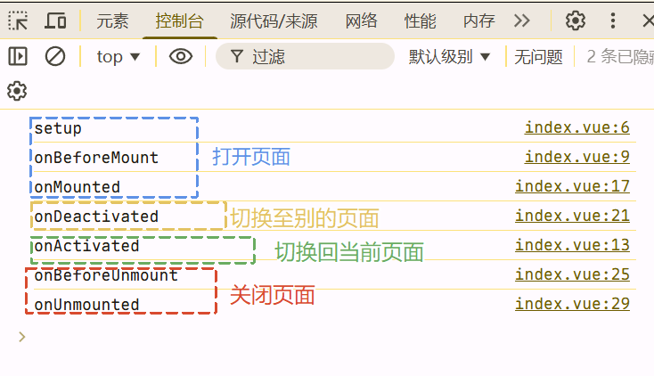

> **声明**：本项目基于 [RuoYi-Vue3](https://github.com/yangzongzhuan/RuoYi-Vue3) 框架修改而来，用于学习和研究 Openlayers 官方示例或源代码之用。

## 项目下载及初始化

> 注：推荐使用 node 的 24 版本来安装或运行项目，这里我使用的 node 版本是`24.12.0`。

```shell
git clone https://github.com/gisnotes/gisnotes-ol.git

cd gisnotes-ol

npm install
# 或者
pnpm install

npm run dev
# 或者
pnpm dev
```

## 开启持久化标签页

如下图所示，可以开启持久化标签页功能：



我们新建一个页面，测试代码如下所示：在script标签上增加一个name属性，这样这个页面便可以被缓存。

```vue
<template>
  <div class="auto-projection">自动投影</div>
</template>

<script setup name="AutoProjection">
console.log("setup");

onBeforeMount(() => {
  console.log("onBeforeMount");
});

onActivated(() => {
  console.log("onActivated");
});

onMounted(() => {
  console.log("onMounted");
});

onDeactivated(() => {
  console.log("onDeactivated");
});

onBeforeUnmount(() => {
  console.log("onBeforeUnmount");
});

onUnmounted(() => {
  console.log("onUnmounted");
});
</script>
```

然后接下来我们将打印一下页面从被打开到关闭执行的生命周期情况：打开页面-》切换到别的标签页-》切换回当前页面-》关闭页面，打印的日志如下图所示：


